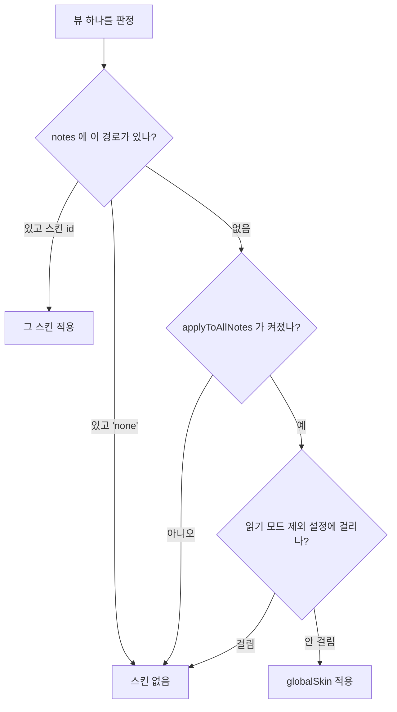

# 스킨 시스템 설계

작성 2026-09-18. **설계 문서이고 아직 구현하지 않았다.**

현재 playmaker 는 터미널 외형 하나만 갖고 있고, 그 안의 팔레트 4종을 `preset` 으로 고른다.
이걸 **여러 스킨 중 하나를 고르는 구조**로 바꾸고, 적용 범위를 노트별과 전역으로 나눈다.

---

## 1. 목표

1. 스킨을 **특정 노트** 또는 **전역(모든 노트)** 에 적용할 수 있다. 전역은 옵션이고 **기본값은 꺼짐**이다.
2. 스킨을 사용자가 고른다.
3. 지금의 터미널 외형은 **여러 스킨 중 하나**가 된다.
4. 새 스킨 하나를 추가한다 — **Letterpress(오래된 편지지)**. 눈이 편안한 쪽에 무게를 둔다.

## 2. 계층이 하나 늘어난다

지금은 팔레트 한 층이다. 앞으로는 두 층이다.

```
스킨 (skin)          외형 그 자체. CSS 구조가 다르다.
└─ 변형 (variant)    같은 스킨 안에서 색만 다른 것
```

| 스킨 id | 화면에 보이는 이름 | 변형 | 성격 |
| --- | --- | --- | --- |
| `terminal` | **나 지금 해커** | 4종 (아래 표) | 이미 있는 것. 스캔라인·인광·프롬프트 |
| `letterpress` | **오래된 편지지** | 1종으로 시작 | 새로 만드는 것. 종이 질감·잉크·세리프 |

### 이름 규칙

**id 는 영문으로 두고, 화면에 보이는 이름만 장면이 떠오르는 별명으로 쓴다.**
id 는 `data.json` 에 저장되는 값이라 바꾸면 기존 설정이 깨진다.

`Ice` · `Mono` 같은 이름은 무엇이 다른지 읽어서 알 수 없다는 지적을 받아 교체했다.
새 변형을 추가할 때도 색 이름(`blue`, `sepia`)이나 기술 용어가 아니라
**어떤 장면인지**로 짓는다.

| 변형 id | 별명 | 무엇이 보이나 |
| --- | --- | --- |
| `green` | 새벽 세시 서버실 | 초록 인광. 고전 CRT |
| `amber` | 낡은 관제실 | 호박색. 따뜻하고 오래된 단말기 |
| `ice` | 빙하 데이터센터 | 청색 형광. 차갑다 |
| `mono` | 흔적 없는 침입 | 무채색. 색을 지운 화면 |
| `cream`(예정) | 다락방에서 찾은 편지 | 바랜 크림지. 갈색 잉크 |

지금의 `preset` 설정값(green 등)은 **`terminal` 스킨의 변형**으로 내려간다.
스킨마다 변형 목록이 다르므로, 변형은 스킨별로 따로 저장한다. 터미널을 amber 로 쓰다가
편지지로 갔다가 다시 터미널로 돌아오면 amber 가 그대로 남아 있어야 한다.

## 3. 적용 범위

### 저장 구조

```ts
interface ScopeSettings {
  /** 노트별 지정. 값은 스킨 id 이거나 'none'(전역이 켜져 있어도 이 노트는 제외). */
  notes: Record<string, SkinId | 'none'>;
  /** 전역 적용 스위치. 기본 false. */
  applyToAllNotes: boolean;
  /** 전역이 켜졌을 때 쓸 스킨. */
  globalSkin: SkinId;
}
```

`skinnedPaths: string[]` 를 `notes: Record<경로, 스킨id>` 로 바꾸는 게 이 설계의 핵심이다.
이러면 **노트마다 다른 스킨**이 공짜로 되고, 전역 예외(`'none'`)도 같은 자료구조로 표현된다.

### 우선순위



**노트별 지정이 전역보다 항상 우선한다.** 전역을 켜두고 특정 노트만 다른 스킨을 쓰거나,
특정 노트만 맨얼굴로 두는 것이 둘 다 된다.

전역이 기본 꺼짐인 이유는 두 가지다. 켜는 순간 vault 의 모든 노트 외형이 바뀌는 건
되돌리기 전까지 계속 눈에 띄는 변화이고, 스킨 CSS 가 붙는 뷰 수가 늘면 그만큼 페인트 비용도 는다.

## 4. 스킨 레지스트리

스킨을 추가할 때 손대는 곳을 한 군데로 모은다.

```ts
interface SkinDefinition {
  id: SkinId;                       // 'terminal' | 'letterpress'
  label: string;                    // 설정 화면에 보일 이름
  /** 이 스킨이 쓰는 스코프 클래스. 예: 'pm-skin-letterpress' */
  className: string;
  variants: Record<string, SkinVariant>;
  defaultVariant: string;
  /** 변형(팔레트) → Obsidian CSS 변수 맵 */
  toVars(variant: SkinVariant, options: SkinOptions): Record<string, string>;
}
```

뷰에는 **공통 클래스 + 스킨 클래스** 두 개를 붙인다.

```
.pm-skin                  공통 골격 (오버레이 앵커, 색 상속 끊기)
.pm-skin-terminal         터미널 전용 규칙
.pm-skin-letterpress      편지지 전용 규칙
```

공통 골격은 이미 검증된 것을 그대로 쓴다 — `.view-content` 를 오버레이 앵커로 삼고,
스코프에 `color` 를 직접 선언해 body 상속을 끊는다. 자세한 근거는 README 의 설계 메모에 있다.

**오버레이는 스킨끼리 구조를 공유한다.** 터미널의 스캔라인과 편지지의 종이 질감은
둘 다 `.view-content::after` 에 `background: var(--pm-overlay)` 하나로 그린다.
스킨은 변수 값만 바꾼다. 앵커·`pointer-events`·`z-index` 같은 위험한 부분을 두 번 만들지 않는다.

## 5. Letterpress 스킨 사양

### 색 — cmux 팔레트에서 채도를 낮춰 잉크로 쓴다

기준값은 이 컴퓨터의 cmux 설정을 실측한 것이다. `~/Library/Application Support/com.mitchellh.ghostty/config.ghostty`
가 비어 있어 ghostty 기본 팔레트가 그대로 적용된다 — 배경 `#282c34`, 전경 `#ffffff`,
팔레트는 Tomorrow Night 계열(`#cc6666` `#b5bd68` `#f0c674` `#81a2be` `#b294bb` `#8abeb7`).

편지지는 **바탕을 크림지로 뒤집고**, cmux 팔레트 색은 잉크와 강조로 가져온다.

| 역할 | 값 | 유래 |
| --- | --- | --- |
| 바탕 | `#f2e8d5` | 바랜 크림 |
| 보조 바탕 (코드블록·표 머리) | `#e9dcc4` | 바탕보다 한 톤 짙게 |
| 본문 | `#3a3226` | 갈색 잉크 |
| 보조 글자 | `#6b6051` | |
| 가장 흐린 것 (구분선·마커) | `#c9bda4` | 바랜 결 |
| 헤딩 | `#8a4a42` | cmux `#cc6666` 채도 낮춤 |
| 링크·태그 | `#4a6b85` | cmux `#81a2be` |
| 코드 | `#6b6a3f` | cmux `#b5bd68` |
| 강조·굵게 | `#8a6a2f` | cmux `#f0c674` |

**대비를 일부러 낮게 잡았다.** 본문 `#3a3226` 과 바탕 `#f2e8d5` 는 명암비 약 9:1 로
본문 가독성 기준(WCAG AA 4.5:1)을 넉넉히 넘기면서, 순흑/순백 조합(21:1)보다 눈이 덜 피로하다.

### 질감과 효과

터미널 스킨과 **정반대 방향**으로 잡는다. 터미널은 발광하고 깜빡이는 화면이고,
편지지는 빛을 내지 않는 종이다.

| 요소 | 방침 |
| --- | --- |
| 인광(`text-shadow`) | **없음.** 0 으로 고정 |
| 애니메이션 | **없음.** 플리커도 커서 깜빡임 특수 처리도 넣지 않는다 |
| 종이 질감 | `.view-content::after` 에 아주 약한 얼룩. 반복 그라데이션 1~2겹, 불투명도 0.03 이하 |
| 가장자리 그늘 | 옵션. `radial-gradient` 로 네 귀퉁이만 살짝 어둡게 (기본 꺼짐) |
| 괘선 | 옵션. 편지지 줄. 기본 꺼짐 — 본문 줄높이와 어긋나면 오히려 산만하다 |
| 글꼴 | 세리프 |

### 글꼴

시스템에 설치된 것을 확인했다 — Iowan Old Style · Charter · Palatino · Baskerville ·
Hoefler Text · Georgia · PT Serif, 그리고 한글 세리프로 **AppleMyungjo** 하나.

기본 스택 제안:

```
"Iowan Old Style", Charter, Palatino, "Apple SD Gothic Neo", serif
```

한글을 AppleMyungjo 로 떨어뜨릴지가 열린 문제다. 명조가 편지지 컨셉에는 맞지만
AppleMyungjo 는 본문 크기에서 가독성이 좋은 편이 아니다. 기본값은 한글을 산세리프로 두고,
설정에서 글꼴 스택을 직접 바꿀 수 있게 한다(이미 있는 기능이다). **실제로 읽어보고 정해야 한다.**

## 6. 설정 스키마와 마이그레이션

```ts
interface PlaymakerSettings {
  version: 2;

  // 적용 범위
  notes: Record<string, SkinId | 'none'>;
  applyToAllNotes: boolean;      // 기본 false
  globalSkin: SkinId;            // 기본 'terminal'

  // 스킨별 상태
  activeSkin: SkinId;            // 토글 명령이 새로 켤 때 쓰는 스킨
  variants: Record<SkinId, string>;      // 스킨마다 마지막으로 고른 변형
  skinOptions: Record<SkinId, object>;   // 스킨별 효과 옵션

  // 공통
  fontFamily: string;
  applyToReadingMode: boolean;
  showStatusBar: boolean;
}
```

기존 `data.json`(version 없음)을 읽으면 이렇게 옮긴다.

| 기존 | 새로 |
| --- | --- |
| `skinnedPaths: string[]` | `notes` 의 각 경로에 `'terminal'` |
| `preset` | `variants.terminal` |
| `glow` · `scanlines` · `flicker` · `blinkCursor` · `showPrompt` · `promptSymbol` | `skinOptions.terminal.*` |
| `fontFamily` · `applyToReadingMode` · `showStatusBar` | 그대로 |

`applyToAllNotes` 는 마이그레이션 시에도 `false` 다. **업데이트했더니 모든 노트가 바뀌어 있는
상황을 만들지 않는다.**

현재 vault 의 `data.json` 은 전 항목 기본값이고 `skinnedPaths` 가 비어 있어서,
실제로는 마이그레이션할 내용이 없다. 그래도 코드는 넣는다.

## 7. 명령과 설정 화면

| 명령 | 변화 |
| --- | --- |
| `스킨 토글 (현재 노트)` | `activeSkin` 으로 켠다. 이름에서 "터미널" 을 빼고 스킨 별명을 쓴다 |
| `스킨 선택 (현재 노트)` | **새로 추가.** 스킨 목록을 띄워 고르게 한다 |
| `스킨 전체 해제` | `notes` 를 비운다. 전역 스위치는 건드리지 않는다 |
| `변형 순환` | 현재 스킨 안에서만 순환한다 |
| `전역 스킨 토글` | **새로 추가.** `applyToAllNotes` 를 뒤집는다 |

설정 화면은 **스킨 선택 → 그 스킨의 변형 → 그 스킨의 옵션** 순으로 접는다.
터미널의 스캔라인·인광 설정이 편지지를 고른 상태에서 보이면 안 된다.

## 8. 구현 단계

| 단계 | 내용 | 완료 기준 |
| --- | --- | --- |
| S1 | 스킨 레지스트리 도입, 기존 터미널을 그 위로 이전 | 외형·동작이 지금과 같다 |
| S2 | 설정 스키마 v2 + 마이그레이션 | 기존 `data.json` 을 읽어도 설정이 날아가지 않는다 |
| S3 | 적용 범위(노트별 `Record` + 전역 스위치) | 전역을 켜면 모든 노트에 붙고, 노트별 지정이 이긴다 |
| S4 | Letterpress 스킨 | 색·질감·글꼴이 사양대로 나온다 |
| S5 | 명령·설정 화면 재구성 | 스킨별 옵션만 보인다 |

S1 을 먼저 두는 이유는, 외형이 그대로인 채로 구조만 바뀌는 단계를 만들어
"스킨 시스템 때문에 깨진 것"과 "새 스킨 때문에 깨진 것"을 나눠 보기 위해서다.

## 9. 확정된 것과 아닌 것

**이미 반영한 것:**

- 변형 4종의 화면 이름을 별명으로 교체 (`src/presets.ts`). id 는 그대로 두었다
- 설정 화면의 '프리셋' 을 '분위기' 로 바꾸고, 어느 스킨의 분위기인지 밝혔다 (`src/settings.ts`)

**실측으로 확정:**

- cmux 는 ghostty 기본 팔레트를 쓴다 (config 파일이 비어 있음). 배경 `#282c34`, 전경 `#ffffff`,
  팔레트 Tomorrow Night 계열
- 세리프 글꼴 가용성 — 라틴 7종 이상, 한글 세리프는 AppleMyungjo 하나
- 현재 `data.json` 상태 (전 항목 기본값, `skinnedPaths` 비어 있음)
- 공통 골격(오버레이 앵커·색 상속·파생 변수)은 브라우저에서 측정해 검증된 것을 재사용한다

**아직 확인하지 않은 것:**

- 밝은 크림 바탕 위에서 Obsidian 기본 UI 요소(선택 영역, 표 테두리, 체크박스, 콜아웃)가
  어떻게 보이는지. 터미널 스킨은 어두운 바탕이라 이 조합을 겪은 적이 없다
- Obsidian 을 다크 테마로 쓰는 중에 뷰 하나만 크림색이 되는 게 실제로 어떤지.
  **의도한 동작이지만 눈에 거슬릴 수 있다**
- 한글 본문에 AppleMyungjo 가 읽을 만한지
- 종이 질감 오버레이의 페인트 비용. 터미널 스캔라인과 같은 자리를 쓰므로 비슷할 것으로
  보지만 측정한 적은 없다
